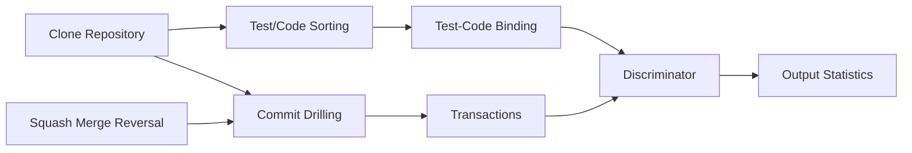

# ApacheMiner
COMP0104: Software Development Practice Coursework 2, which investigates the evidence that projects are adopting Test-First or Test-Driven Approach and how strictly they follow the practice.


## :rocket: Running the project 

this project uses poetry to manage dependencies, and the virtual environment. This project is using python3.12, so make sure you are using it 

```bash
python3.12 -m pip install poetry 
```


### :inbox_tray: Installing dependencies 

To install the dependencies, run the following commands in the root directory of the project


```bash
poetry install 
```

### :gear: running commands

to run the set commands in the project, you can use the following command 


```bash 
poetry run <command>

```

or you can run the cli using 
```bash 
poetry run cli
```

you can alternatively run the shell and directly run the cli 

```bash
poetry shell
python3 src
```

## :shield: Running Test 

before pushing, make sure you run the noxfile to ensure that everything is working fine
```bash 
poetry run nox 
```

this will run the entire test suite, and ensure that linting, formatting, type hinting is correct.


## :whale: Using docker 

You can also use docker to run the project, to build the docker image, you can use the following command 

```bash
docker build -t apache-miner .
```

to run the docker image, you can use the following command 

```bash
docker run -it apache-miner <command>
```


# ⚡ How it works 

We take a repository and feed it into this pipeline 



## ⛏️ Commit Drilling 

Commit drilling using [pydriller](https://github.com/ishepard/pydriller) in a topological order such that we maintain the order of commits to the main branch. If squash merged reversal is activated, it is also intertwined with the drilling step. To drill a repository use the ``drill`` subcommand.

## ⏪ Squash Merge Reversal

If Squash Merge Reversal is on, then a github token is required to be stored as an environment variable. Store it in `.env` file for automatic loading with variable `GITHUB_TOKEN=`. 

The squash merge reversal algorithm works by fetching all `merged` pull requests that have a `merge_head_sha` that is different from the pull request's `head.sha`. Then when the driller is drilling, we intercept commits with the same `merge_head_sha` replace them with the pull requests's commits. 

To use squsah merge reversal add the ``--reverse_squash`` flag to the ``drill`` subcommand to view joint drilling data, or with the ``discriminate`` subcommand

## 🧪 Transaction Transformation

Transforming the commits into a list of transactions where links between names are maintained in the event that they are renamed, and identified with the a unique id. This step can be view by the ``transform`` subcommand

## 🔎 Test/Source Identification

Based on the repository type, we identify the source code files, and test files that are testing it, and group them separately. 

## 🪛 Test-Code Binding

The Test-Code Binding is determined by the BindingStrategy, the owned that are currently defined are 

| Strategy | Effect |
|----------|--------|
| Import   | If the test file imports the source code file there is a link between the test to the source |
| RecursiveImport | Recursively check the imports and link them to the test |
| Naming   | If the test file contains the prefix Test followed by the source file name |

## 🖨️ Discriminator 

The Discriminator generates a set of statistics based on the data given. The ones that are given are the following


| Strategy | Effect |
|----------|--------|
| FirstCommit   | Checks whether a source file was committed before, at the same time or after any of its commits |
| CommitSequence | Checks whether a source file contains a test file between its commits, and measures the % of times it has, and based on a threshold it determines whether its test-first |
| Branch   | Mixture of FirstCommit and CommitSequence, but reverse engineers the branches and runs FirstCommit on each branch |

You can run the discriminator using the ``discriminate`` command

# ⚙️ Commands

There are various commands that you can use for this project, the pipeline is broken into several stages so that it can be inspected at each stage for debugging purposes. You can get more information by running the cli with the --help flag to display more information, e.g.

```bash
poetry run cli --help
```

which would display the commands that can be used, and to get more information on how to use the command use 

```bash
poetry run cli <COMMAND> --help
```


